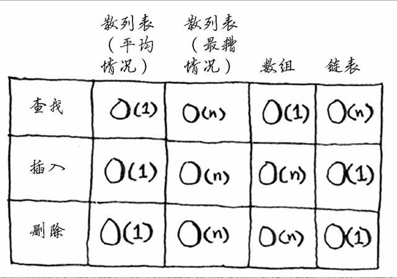

# 1.栈
### 阿里巴巴技术笔试题
一个栈的入栈顺序为ABCDEF，则不可能的出栈顺序为（ D ）：
A:DEFCBA  B:DCEFBA  C:FEDCBA  D:FECDBA  E:ABCDEF  F:ADCBFE

### 分析
该题目主要考察栈的核心思想为先进后出，并且需要注意入栈和出栈的顺序是未知的，例如你可以先入栈ABCD，然后出栈D，在入栈E，出栈E，入栈F，出栈F，然后CBA依次出栈，也就是A选项。
DEFCBA：入栈ABCD，出栈D，入栈E，出栈E，入栈F，出栈F，出栈CBA
DCEFBA：入栈ABCD，出栈DC，入栈E，出栈E，入栈F，出栈F，出栈BA
FEDCBA：入栈ABCDEF，出栈FEDCBA
FECDBA：入栈ABCDEF，出栈FE，出栈CD（此处已不合理，应该是出栈DC）
ABCDEF：入栈A，出栈A，入栈B，出栈B，入栈C，出栈C。。。。
ADCBFE：入栈A，出栈A，入栈BCD，出栈DCB，入栈EF，出栈FE

### 规律
任何出栈的元素后面出栈的元素必须满足以下三点：
1、在原序列中相对位置比他小的，必须是逆序；
2、在原序列中相对位置比他大的，顺序没有要求；
3、以上两点可以间插进行。

### 算法复杂度

### 数据结构
